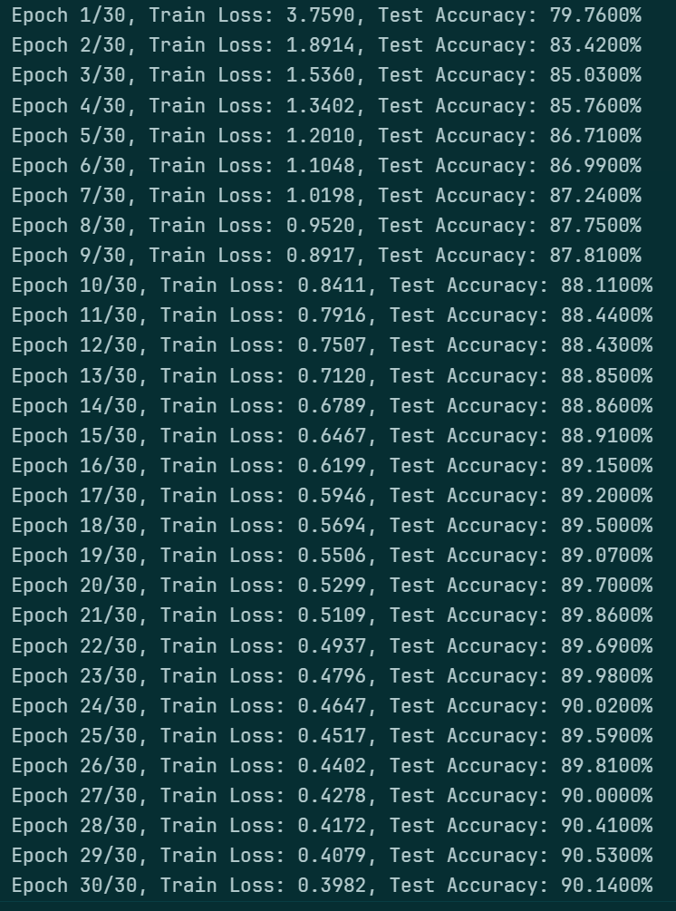

# Lab 3：手写数字识别

:man_student: Charles

## 实验概述

仅使用numpy和pytorch中的tensor库（以及torch中相关基本计算方法）手动实现含单隐藏层的前馈神经网络模型以及反向梯度传播的学习过程，来进行MNIST数据集上的手写数字识别。

## 实验过程

### 数据准备

首先，在 [MNIST官网](https://web.archive.org/web/20220509025752/http://yann.lecun.com/exdb/mnist/) 下载手写数字数据集，保存至本地 `data_folder` 并解压：

```python
import gzip
import shutil
import os

data_folder = "../data"

for file_name in os.listdir(data_folder):
    if file_name.endswith(".gz"):
        file_path = os.path.join(data_folder, file_name)
        out_path = file_path.replace(".gz", "")  # 解压后的文件路径

        # 解压文件
        with gzip.open(file_path, 'rb') as in_file:
            with open(out_path, 'wb') as out_file:
                shutil.copyfileobj(in_file, out_file)
```

根据官网提供的数据格式说明，载入图片和标签数据：

```python
import numpy as np

def load_images(file_path):
    """ 载入图片数据 """
    with open(file_path, 'rb') as f:
        f.read(16)  # 根据MNIST数据集格式，跳过元数据
        data = np.frombuffer(f.read(), dtype=np.uint8)
        data = data.reshape(-1, 28, 28)  # 每张图片为 28x28 的灰度值图片
    return data


def load_labels(file_path):
    """ 载入标签数据 """
    with open(file_path, 'rb') as f:
        f.read(8)  # 根据MNIST数据集格式，跳过元数据
        labels = np.frombuffer(f.read(), dtype=np.uint8)
    return labels


train_images = load_images(data_folder + "/train-images-idx3-ubyte")
train_labels = load_labels(data_folder + "/train-labels-idx1-ubyte")
test_images = load_images(data_folder + "/t10k-images-idx3-ubyte")
test_labels = load_labels(data_folder + "/t10k-labels-idx1-ubyte")
```

可视化一部分数据作检查：

```python
import matplotlib.pyplot as plt

def visualize(images, labels, num_samples=10):
    plt.figure(figsize=(10, 2))
    for i in range(num_samples):
        plt.subplot(1, num_samples, i + 1)
        plt.imshow(images[i], cmap='gray')
        plt.title(f"Label: {labels[i]}")
        plt.axis('off')
    plt.show()

    
visualize(train_images, train_labels)  # 可视化训练集的前10张图像
visualize(test_images, test_labels)  # 可视化测试集的前10张图像
```

可以看到，数据已经正确载入：

 

下面，进行一些数据预处理。

为了加速后续计算，将数据放到tensor中：

```python
import torch

my_device = torch.device("cuda" if torch.cuda.is_available() else "cpu")

train_images_tensor = torch.tensor(train_images, dtype=torch.float32, device=my_device)
train_labels_tensor = torch.tensor(train_labels, dtype=torch.long, device=my_device)
test_images_tensor = torch.tensor(test_images, dtype=torch.float32, device=my_device)
test_labels_tensor = torch.tensor(test_labels, dtype=torch.long, device=my_device)
```

将数据展平并归一化，便于后续神经网络的数据输入：

```python
train_images_tensor =  train_images_tensor.flatten(start_dim=1) / 255.0
test_images_tensor = test_images_tensor.flatten(start_dim=1) / 255.0
```

手动实现Dataset和DataLoader类，便于后续训练时按批次加载数据：

```python
class MyDataset:
    def __init__(self, images, labels):
        self.images = images
        self.labels = labels

    def __len__(self):
        return len(self.images)
    
    def __getitem__(self, id):
        return self.images[id], self.labels[id]
    
    
class MyDataLoader:
    def __init__(self, dataset, batch_size=1, shuffle=False, device='cpu'):
        self.dataset = dataset
        self.batch_size = batch_size
        self.shuffle = shuffle
        self.ids = np.arange(len(dataset))  # 索引列表
        self.cur_id = 0
        self.device = device

    def __iter__(self):
        self.cur_id = 0  # 重置索引
        if self.shuffle:
            np.random.shuffle(self.ids)  # 打乱索引
        return self
    
    def __next__(self):
        if self.cur_id >= len(self.dataset):
            raise StopIteration
        
        # 获取一个batch的索引
        batch_ids = self.ids[self.cur_id : self.cur_id + self.batch_size]
        
        # 获取一个batch的对应数据
        batch_data = [self.dataset[i] for i in batch_ids]
        
        # 返回一个batch的图片和标签（并改为tensor类型）
        images, labels = zip(*batch_data)
        images = torch.stack(images).to(self.device)
        labels = torch.tensor(labels).to(self.device)
        self.cur_id += self.batch_size
        return images, labels

    def __len__(self):
        """ 数据集的大小，即总批次数量 """
        return int(np.ceil(len(self.dataset) / self.batch_size)) 
```

用上述DataLoader包装数据：

```python
train_set = MyDataset(train_images_tensor, train_labels_tensor)
test_set = MyDataset(test_images_tensor, test_labels_tensor)

train_loader = MyDataLoader(train_set, batch_size=64, shuffle=True, device=my_device)
test_loader = MyDataLoader(test_set, batch_size=64, shuffle=False, device=my_device)
```

### 模型实现

> [!TIP]
>
> 首先，需要实现线性层、激活函数（ReLU）、Softmax函数、损失函数（交叉熵损失）等组件。
>
> 同时，由于后续神经网络中的前向&反向传播也要手动实现，故上述组件的 `forward` 和 `backward` 方法也需要先定义好。

#### 线性变换层

##### 前向传播

线性变换的数学定义为：

$$
y = xW^T + b
$$

其中：

- $x$ 是大小为 $input\_size$ 输入向量
- $W$ 是形状为 $(output\_size, input\_size)$ 的权重矩阵
- $b$ 是大小为 $output\_size$ 的偏置项
- $y$ 是大小为 $output\_size$ 的输出向量

据此，可写出线性层的前向传播代码：

```python
def forward(self, x):
    """ 前向传播 """
    self.x = x.to(self.device)
    y = torch.matmul(x, self.weights.T) + self.bias
    return y
```

##### 反向传播

在反向传播过程中，需要计算各参数（即 $W$ 和 $b$ ）的梯度以更新参数，并计算本层输入的梯度传回上一层。

首先，损失 $L$ 对线性层输出 $y$ 的梯度为 $\frac{\partial L}{\partial y}$ ，该梯度会由下一层反向传播回来。

> 后续代码中，下一层传回本层的梯度均记作 `grad_out` （out表示是对本层输出的梯度）

计算 $L$ 对 $W$ 的梯度 $\frac{\partial L}{\partial W}$ ，根据链式法则有：

$$
\frac{\partial L}{\partial W} = \frac{\partial L}{\partial y} \cdot \frac{\partial y}{\partial W}
$$

其中， $\frac{\partial y}{\partial W}$ 即在线性变换 $y = xW^T + b$ 中对 $W$ 求偏导，易得结果为 $x$ ，所以 $W$ 的反向传播公式为：

$$
\frac{\partial L}{\partial W} = \frac{\partial L}{\partial y} \cdot x
$$

代码层面，考虑按批次训练，则 $\frac{\partial L}{\partial y}$ 是形状为 $(batch\_size, output\_size)$ 的梯度矩阵， $x$ 是形状为 $(batch\_size, input\_size)$ 的输入矩阵，故它们相乘时前者需要转置：

```python
self.grad_weights = torch.matmul(grad_out.T, self.x)
```

计算 $L$ 对 $b$ 的梯度 $\frac{\partial L}{\partial b}$ ，根据链式法则有：

$$
\frac{\partial L}{\partial b} = \frac{\partial L}{\partial y} \cdot \frac{\partial y}{\partial b}
$$

其中， $\frac{\partial y}{\partial b}$ 即在线性变换 $y = xW^T + b$ 中对 $b$ 求偏导，易得结果为 $1$ ，所以 $b$ 的反向传播公式为：

$$
\frac{\partial L}{\partial b} = \frac{\partial L}{\partial y}
$$

代码层面，考虑按批次训练，即 $\frac{\partial L}{\partial b} = \sum^{batch\_size}_{i =1}\frac{\partial L}{\partial y_i}$ ，有：

```python
self.grad_bias = torch.sum(grad_out, dim=0)
```

计算 $L$ 对线性层输入 $x$ 的梯度 $\frac{\partial L}{\partial x}$ ，根据链式法则有:

$$
\frac{\partial L}{\partial x} = \frac{\partial L}{\partial y} \cdot \frac{\partial y}{\partial x}
$$

其中， $\frac{\partial y}{\partial x}$ 即在线性变换 $y = xW^T + b$ 中对 $x$ 求偏导，易得结果为 $W$ ，所以 $x$ 的反向传播公式为：

$$
\frac{\partial L}{\partial x} = \frac{\partial L}{\partial y} \cdot W
$$

相应代码为：

```python
grad_in = torch.matmul(grad_out, self.weights)
```

> 后续代码中，本层传给上一层的梯度均记作 `grad_in` （in表示是对本层输入的梯度）

##### 更新参数

根据上面计算出的参数梯度，按照梯度下降法更新参数：

$$
W \leftarrow W - \eta \cdot \frac{\partial L}{\partial W} \\
b \leftarrow b - \eta \cdot \frac{\partial L}{\partial b}
$$

其中 $\eta$ 为学习率。

据此写出相应代码为：

```python
def update(self, lr):
    """ 更新参数 """
    self.weights = self.weights - lr * self.grad_weights
    self.bias = self.bias - lr * self.grad_bias
```

其中 `lr` 为学习率。

##### 整体实现

综上，线性层组件的整体代码实现为：

```python
class MyLinear():
    """ 线性变换层
    
    Args:
        input_size (int): 输入特征的数量
        output_size (int): 输出特征的数量
        
    Examples:
        >>> input = torch.randn(128, 20)
        >>> m = MyLinear(20, 30)
        >>> output = m.forward(input)
        >>> print(output.size())
        torch.Size([128, 30])
    """
    def __init__(self, input_size, output_size, device="cpu"):
        # 正态随机初始化权重和偏置
        self.device = device
        self.weights = torch.randn(output_size, input_size, device=self.device)
        self.bias = torch.randn(output_size, device=self.device)

    def forward(self, x):
        """ 前向传播 """
        self.x = x.to(self.device)
        y = torch.matmul(x, self.weights.T) + self.bias
        return y
    
    def backward(self, grad_out):
        """ 反向传播 """
        self.grad_weights = torch.matmul(grad_out.T, self.x)
        self.grad_bias = torch.sum(grad_out, dim=0)
        grad_in = torch.matmul(grad_out, self.weights)
        return grad_in

    def update(self, lr):
        """ 更新参数 """
        self.weights = self.weights - lr * self.grad_weights
        self.bias = self.bias - lr * self.grad_bias
```

#### 激活函数层（ReLU）

##### 前向传播

ReLU函数的数学定义为：

$$
y = ReLU(x) = 
\begin{cases}
x, \ x >0 \\
0, \ x \le 0
\end{cases}
$$

据此，可写出ReLU层的前向传播代码：

```python
def forward(self, x):
    self.x = x
    y = torch.maximum(x, torch.tensor(0.0))
    return y
```

##### 反向传播

计算ReLU层的梯度，即损失 $L$ 对输入 $x$ 的偏导数 $\frac{\partial L}{\partial x}$ 。由于反向传播过程中，下一层会传回 $L$ 对ReLU输出 $y$ 的梯度 $\frac{\partial L}{\partial y}$ ，故根据链式法则ReLU的梯度可以写成

$$
\frac{\partial L}{\partial x} = \frac{\partial L}{\partial y} \cdot \frac{\partial y}{\partial x}
$$

其中， $\frac{\partial y}{\partial x}$ 即对 $ReLU(x)$ 求导，易得：

$$
\frac{\partial y}{\partial x} = 
\begin{cases}
1, \ x >0 \\
0, \ x \le 0
\end{cases}
$$

所以，ReLU的反向传播公式为：

$$
\frac{\partial L}{\partial x} = \frac{\partial L}{\partial y} \cdot
\begin{cases}
1, \ x >0 \\
0, \ x \le 0
\end{cases}
= 
\begin{cases}
\frac{\partial L}{\partial y}, \ x >0 \\
0, \quad  x \le 0
\end{cases}
$$

根据上面的公式，可以写出反向传播代码：

```python
def backward(self, grad_output):
    grad_input = grad_output.clone()
    grad_input[self.x <= 0] = 0  # 对于非正的输入，梯度为零
    return grad_input
```

##### 整体实现

综上，ReLU组件的整体代码实现为：

```python
class ReLU:
    def forward(self, x):
        self.x = x  # 保存输入以便后向传播使用
        return torch.maximum(x, torch.tensor(0.0))
    
    def backward(self, grad_output):
        grad_input = grad_output.clone()
        grad_input[self.x <= 0] = 0  # 对于小于零的输入，梯度为零
        return grad_input
```

#### Softmax层（含交叉熵损失函数）

##### 前向传播

Softmax函数的数学定义为：

对于输入向量 $\ x = [x_1, \ x_2, \dots, \ x_n]$ ，Softmax的输出向量 $\hat{y} = [\hat{y}_1, \ \hat{y}_2, \dots, \ \hat{y}_n]$ 中的每个元素 $\hat{y}_i$ 有

$$
\hat{y}_i = Softmax(x_i) = \frac{e^{x_i}}{\sum^{n}_{j=1} e^{x_j}}, \ \ j = 1,2,\dots,n
$$

故Softmax的输出 $\hat{y}$ 是一个概率分布（代码中将其记作 `probs` ），据此可写出其前向传播代码：

```python
def forward(self, x):
    x_max = torch.max(x, dim=1, keepdim=True) # 防止溢出，减去最大值来增加数值稳定性
    x_exp = torch.exp(x - x_max.values)
    self.probs = x_exp / torch.sum(x_exp, dim=1, keepdim=True)
    return self.probs
```

##### 交叉熵损失

交叉熵（cross entropy）的数学定义为：

$$
H(p, q) = - \sum_{x}p(x) \log{q(x)}
$$

其中 $p, q$ 是两个概率分布。因此本实验中，可以先将实际标签进行one-hot编码，则对于每个样本，其交叉熵损失函数为：

$$
L(y, \ \hat{y}) = -\sum^{C}_{j=1} y_j \log{\hat{y_j}}
$$

其中：

- $C$ 是类别数（本实验中为10）
- $y$ 是该样本的真实标签（one-hot分布）， $y_j$ 表示其在标签 $j$ 上的one-hot值（0或1）
- $\hat{y}$ 是该样本的预测标签（概率分布）， $\hat{y_j}$ 表示预测的该样本属于标签 $j$ 的概率（由softmax得出）

因此，对于每一批次的 $N$ 个样本，可得其mini-batch损失为：

$$
L = - \frac{1}{N} \sum^{N}_{i=1} \sum^{C}_{j=1}{y_j \log{\hat{y_j}}}
$$

据此，可写出交叉熵损失函数代码：

```python
def cross_entropy(self, predictions, truths):
    probs = self.probs  # Softmax得到的预测标签的概率分布

    # 设定一个最小值min_val，防止log(0)
    min_val = 1e-6
    probs = torch.where(probs < min_val, torch.full_like(probs, min_val), probs)

    # 计算交叉熵损失
    batch_size = predictions.shape[0]
    truth_onehot = torch.zeros(batch_size, probs.shape[1], device=my_device)
    truth_onehot[torch.arange(batch_size), truths] = 1
    loss = -torch.mean(torch.sum(truth_onehot * torch.log(probs), dim=1))

    self.batch_size = batch_size  # 批次大小
    self.truth_onehot = truth_onehot  # 真实标签的one-hot分布

    return loss
```

##### 反向传播

计算Softmax层的梯度，即 $L$ 对输入 $x$ 的偏导数 $\frac{\partial{L}}{\partial{x}}$ 。根据链式法则，可将其写成

$$
\frac{\partial L}{\partial x} = \frac{\partial L}{\partial{\hat{y}}} \cdot \frac{\partial{\hat{y}}}{\partial x}
$$

故对于 $x$ 中的某个样本 $x_i$ ，有

$$
\frac{\partial L}{\partial x_i} = \frac{\partial L}{\partial{\hat{y}}} \cdot \frac{\partial{\hat{y}}}{\partial x_i} \quad (1)
$$


其中 $\hat{y}$ 是Softmax层的输出。根据上面的Softmax公式，对于某个样本有：

$$
\frac{\partial L}{\partial{\hat{y}_j}} = \frac{\partial{(-\sum^{C}_{j=1} y_j \log{\hat{y}_j}})}{\partial{\hat{y}_j}} = - \frac{y_j}{\hat{y}_j} \quad (2)
$$

将 $(1)$ 展开后可带入 $(2)$ ：

$$
\frac{\partial L}{\partial x_i} 
= \frac{\partial L}{\partial{\hat{y}}} \cdot \frac{\partial{\hat{y}}}{\partial x_i} 
= \sum^{n}_{j=1} \frac{\partial L}{\partial{\hat{y}_j}} \cdot \frac{\partial{\hat{y}_j}}{\partial x_i} 
= - \sum^{n}_{j=1} \frac{y_j}{\hat{y}_j} \cdot \frac{\partial{\hat{y}_j}}{\partial x_i} \quad (3)
$$

不妨假设该样本的正确标签为 $k$ ，即one-hot编码后的 $y = [y_1, \ y_2, \dots, \ y_n]$ 中，只有 $y_k = 1$ 、其他 $y_j=  0$ ， 则 $(3)$ 可以进一步化简为：

$$
\frac{\partial L}{\partial x_i} = - \frac{y_k}{\hat{y}_k} \cdot \frac{\partial{\hat{y}_k}}{\partial x_i} 
\quad (4)
$$

显然，接下来需要计算 $\frac{\partial{\hat{y}_k}}{\partial x_k}$ 。需要分两种情况：

- 当 $i = k$ ，

$$
\begin{align}
\frac{\partial{\hat{y}_k}}{\partial x_i}
&= \frac{\partial{\hat{y}_k}}{\partial x_k} \\
&= \frac{\partial{(\frac{e^{x_k}}{\sum^{n}_{j=1} e^{x_j}}})}{\partial{x_k}} \\
&= \frac{e^{x_k}(\sum^{n}_{j=1}{e^{x_j}}) - (e^{x_k})^2}{(\sum^{n}_{j=1}{e^{x_j}})^2} \\
&= \frac{e^{x_k}}{\sum^{n}_{j=1} e^{x_j}} - (\frac{e^{x_k}}{\sum^{n}_{j=1}{e^{x_j}}})^2 \\
&= \hat{y}_k - {\hat{y}_k}^2 \\
&= \hat{y}_k(1 - \hat{y}_k)
\end{align}
\quad (5)
$$


- 当 $i \neq k$ ，

$$
\begin{align}
\frac{\partial{\hat{y}_k}}{\partial x_i}
&= \frac{\partial{(\frac{e^{x_k}}{\sum^{n}_{j=1} e^{x_j}}})}{\partial{x_i}} \\
&= \frac{-e^{x_k} \cdot e^{x_i}}{(\sum^{n}_{j=1}{e^{x_j}})^2} \\
&= - \frac{e^{x_k}}{\sum^{n}_{j=1} e^{x_j}} \cdot \frac{e^{x_i}}{\sum^{n}_{j=1}{e^{x_j}}} \\
&= - \hat{y}_k \cdot \hat{y}_i
\end{align}
\quad (6)
$$

将 $(5), (6)$ 带入 $(4)$ ，得：

$$
\frac{\partial L}{\partial x_i} 
= 
\begin{cases}
- \frac{y_k}{\hat{y}_k} \cdot \hat{y}_k(1 - \hat{y}_k) = -y_k(1 - \hat{y}_k) = \hat{y}_k - 1, \quad i=k \\
- \frac{y_k}{\hat{y}_k} \cdot (-\hat{y}_k \cdot \hat{y}_i) = y_k \cdot \hat{y}_i = \hat{y}_i, \quad  i \neq k \\
\end{cases}
$$

综上所述，可以得到Softmax层的反向传播公式为：

$$
\frac{\partial L}{\partial x}
= 
\begin{bmatrix}
\frac{\partial{L}}{\partial{x_1}} \\
\dots \\
\frac{\partial{L}}{\partial{x_k}} \\
\dots \\
\frac{\partial{L}}{\partial{x_n}} \\
\end{bmatrix}
=
\begin{bmatrix}
\frac{\partial{L}}{\partial{x_1}} \\
\dots \\
\frac{\partial{L}}{\partial{x_k}} \\
\dots \\
\frac{\partial{L}}{\partial{x_n}} \\
\end{bmatrix}
= 
\begin{bmatrix}
\hat{y}_1 \\
\dots \\
\hat{y}_k - 1 \\
\dots \\
\hat{y}_n \\
\end{bmatrix}
$$

由于 $y_k = 1$ 、其他 $y_i = 0$ ，上式可以改写成：

$$
\frac{\partial L}{\partial x} 
=
\begin{bmatrix}
\hat{y}_1 \\
\dots \\
\hat{y}_k - 1 \\
\dots \\
\hat{y}_n \\
\end{bmatrix}
= 
\begin{bmatrix}
\hat{y}_1 - y_1 \\
\dots \\
\hat{y}_k - y_k \\
\dots \\
\hat{y}_n - y_n \\
\end{bmatrix}
=
\hat{y} - y
$$

代码层面， $\hat{y}$ 即Softmax输出的概率分布 `probs` 、 $y$ 即真实标签的one-hot分布，考虑批次处理则结果还需除以 `batch_size` 。故可写出反向传播代码为：

```python
def backward(self):
    grad_in = (self.probs - self.truth_onehot) / self.batch_size
    return grad_in
```

##### 整体实现

综上所述，Softmax层的整体代码实现为：

```python
class Softmax:
    def __init__(self, device="cpu"):
        self.device = device

    def forward(self, x):
        x_max = torch.max(x, dim=1, keepdim=True) # 防止溢出，减去最大值来增加数值稳定性
        x_exp = torch.exp(x - x_max.values)
        self.probs = x_exp / torch.sum(x_exp, dim=1, keepdim=True)
        return self.probs
    
    def cross_entropy(self, predictions, truths):
        probs = self.probs  # Softmax得到的预测标签的概率分布

        # 设定一个最小值min_val，防止log(0)
        min_val = 1e-6
        probs = torch.where(probs < min_val, torch.full_like(probs, min_val), probs)

        # 计算交叉熵损失
        batch_size = predictions.shape[0]
        truth_onehot = torch.zeros(batch_size, probs.shape[1], device=self.device)
        truth_onehot[torch.arange(batch_size), truths] = 1
        loss = -torch.mean(torch.sum(truth_onehot * torch.log(probs), dim=1))

        self.batch_size = batch_size  # 批次大小
        self.truth_onehot = truth_onehot  # 真实标签的one-hot分布

        return loss

    def backward(self):
        grad_in = (self.probs - self.truth_onehot) / self.batch_size
        return grad_in
```

#### 含单隐藏层的前馈神经网络（MLP）

由于上面已经实现了各组件的前向和反向传播方法，故实现模型时只需要按顺序将它们组合在一起即可：

```python
class MLP:
    def __init__(self, input_size, hidden_size, output_size, device="cpu"):
        """ 初始化单隐藏层网络 """
        self.fc1 = MyLinear(input_size, hidden_size, device)  # 输入到隐藏层的线性变换
        self.relu = ReLU()  # 隐藏层激活函数
        self.fc2 = MyLinear(hidden_size, output_size, device)  # 隐藏层到输出层的线性变换
        self.softmax = Softmax(device)  # 输出层的 Softmax 激活
    
    def forward(self, x):
        """ 前向传播 """
        x = self.fc1.forward(x)  
        x = self.relu.forward(x)  
        x = self.fc2.forward(x)  
        x = self.softmax.forward(x)  
        return x

    def backward(self):
        """ 反向传播 """
        grad = self.softmax.backward()
        grad = self.fc2.backward(grad)
        grad = self.relu.backward(grad)
        grad = self.fc1.backward(grad)

    def update(self, lr):
        """ 更新参数 """
        self.fc1.update(lr)
        self.fc2.update(lr)
```

### 训练评估

训练模型，并记录训练过程中模型在训练集和测试集上的损失进行可视化：

```python
def train_and_evaluate(model, train_loader, test_loader, epochs, learning_rate):
    train_loss_history = []
    test_loss_history = []
    
    for epoch in range(epochs):
        total_loss = 0
        for images, labels in train_loader:
            probs = model.forward(images)  # 前向传播
            loss = model.softmax.cross_entropy(probs, labels)  # 计算损失
            model.backward()  # 反向传播
            model.update(learning_rate)  # 更新参数
            total_loss += loss.item()
        
        # 计算平均训练损失
        avg_train_loss = total_loss / len(train_loader)
        train_loss_history.append(avg_train_loss)
        
        # 评估模型在测试集上的准确率
        accuracy, avg_test_loss = evaluate(model, test_loader)
        test_loss_history.append(avg_test_loss)

        print(f"Epoch {epoch+1}/{epochs}, "
              f"Train Loss: {avg_train_loss:.4f}, "
              f"Test Accuracy: {(accuracy * 100):.4f}%")
        
    # 绘制曲线
    plt.figure(figsize=(10, 6))
    plt.plot(range(epochs), train_loss_history, label='Train Loss')
    plt.plot(range(epochs), test_loss_history, label='Test Loss')
    plt.xlabel('Epoch')
    plt.ylabel('Loss')
    plt.title('Training and Test Loss Curve')
    plt.legend()
    plt.grid(True)
    plt.show()


def evaluate(model, test_loader):
    correct = 0
    total = 0
    total_test_loss = 0
    
    for images, labels in test_loader:
        probs = model.forward(images)
        loss = model.softmax.cross_entropy(probs, labels)
        total_test_loss += loss.item()
        
        # 获取预测的类别
        _, predicted = torch.max(probs, dim=1)  # 输出每行最大值的索引，即预测的类别
        
        # 统计正确预测的数量
        correct += (predicted == labels).sum().item()
        total += labels.size(0)  
    
    accuracy = correct / total  # 计算准确率
    avg_test_loss = total_test_loss / len(test_loader)
    
    return accuracy, avg_test_loss
```

设定超参数，开始训练：

```python
# 训练和评估
input_size = 784
hidden_size = 128
output_size = 10
n_epochs = 30
lr = 1e-2
batch_size = 64

train_loader = MyDataLoader(train_set, batch_size, shuffle=True, device=my_device)
test_loader = MyDataLoader(test_set, batch_size, shuffle=False, device=my_device)

model = MLP(input_size, hidden_size, output_size, my_device)

train_and_evaluate(
    model=model,
    train_loader=train_loader,
    test_loader=test_loader,
    epochs=n_epochs,
    learning_rate=lr
)
```

上述初始超参数下，训练结果如下：

 

 

可以看到，最终准确率收敛在90%左右。为了提高准确率，尝试减小批次大小、增加隐藏层神经元个数、调整学习率等，部分实验结果如下：

| `hidden_size` | `lr`  | `batch_size` | `n_epochs` | 收敛准确率（+-0.1%） |
| ------------- | ----- | ------------ | ---------- | -------------------- |
| 128           | 0.01  | 64           | 30         | 90.3%                |
| 256           | 0.01  | 64           | 30         | 92.8%                |
| 512           | 0.01  | 64           | 30         | 93.7%                |
| 512           | 0.001 | 32           | 30         | 91.3%                |
| 512           | 0.02  | 32           | 20         | 95.1%                |
| 512           | 0.05  | 16           | 20         | 95.7%                |
| 1024          | 0.01  | 128          | 30         | 93.8%                |
| 1024          | 0.1   | 16           | 20         | 96.5%                |

本次实验中模型最好的分类准确度为96.5%左右：

 

相关超参数为：

```python
hidden_size = 1024
n_epochs = 30
lr = 0.1
batch_size = 16
```

可以看到，由于本实验的数据集比较简单，将学习率设置得比较高（0.1）模型仍能收敛。

