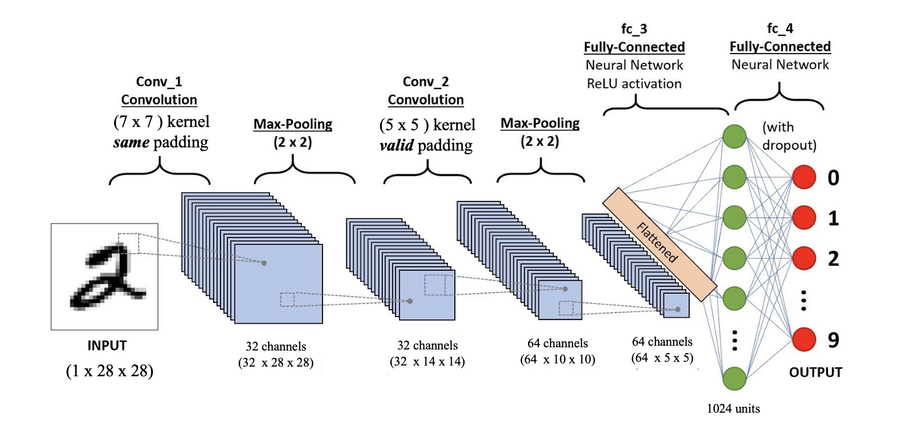
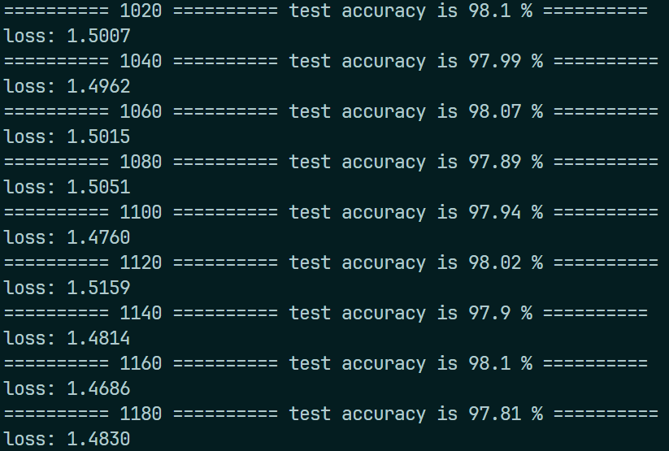

# Lab 4：卷积神经网络

:man_student: Charles

## 习题1

1. **对于一个输入为 $100 \times 100 \times 256$ 的特征映射组，使用 $3 \times 3$ 的卷积核，输出为 $100 \times 100 \times 256$ 的特征映射组的卷积层，求其时间和空间复杂度。**

   - 空间复杂度：共需要 $256 \times 256 \times 3^2 + 256 = 590080$ 个参数，故空间复杂度约为 $O(5.9 \times 10^5)$ 。

   - 时间复杂度：

     - 输出的每组特征映射大小为 $100 \times 100 = 10^4$ 
     - 上面已求出可训练参数个数约为 $5.9 \times 10^5$ 
     - 故连接数为 $5.9 \times 10^5 \times 10^4 = 5.9 \times 10^9$

     即时间复杂度约为 $O(5.9 \times 10^9)$ 

2. **如果引入一个 $1 \times 1$ 卷积核，先得到 $100 \times 100 \times 64$ 的特征映射组，再进行 $3 \times 3$ 的卷积得到 $100 \times 100 \times 256$ 的特征映射组，求其时间和空间复杂度。**

   - 空间复杂度：第一次卷积共有 $256 \times 64 \times 1^2 + 64 = 16448$ 个参数，第二次卷积共有 $64 \times 256 \times 3^2 + 256 = 147712$ 个参数，二者相加可得空间复杂度约为 $O(1.6 \times 10^5)$ 

   - 时间复杂度：

     - 第一次卷积输出的每组特征映射大小为 $100 \times 100 = 10^4$ ，可训练参数个数为 $16448$ ，连接数为 $16448 \times 10^4 \approx 1.6 \times 10^8$ 
     - 第二次卷积输出的每组特征映射大小为 $100 \times 100 = 10^4$ ，可训练参数个数为 $147712$ ，连接数为 $147712 \times 10^4 \approx 1.5 \times 10^9$ 
     - 总连接数为 $1.6 \times 10^8 + 1.5 \times 10^9 \approx 1.66 \times 10^9$ 

     即时间复杂度约为 $O(1.66 \times 10^9)$   

## 习题2

### 问题描述

利用卷积神经网络实现对 `MNIST` 数据集的分类问题，完成代码填空，模型训练精度应该在96%以上。

### 模型实现

根据给出的CNN结构：



完成各层的定义如下：

```python
class CNN(nn.Module):
    def __init__(self):
        super(CNN, self).__init__()
        self.conv1 = nn.Conv2d(
            in_channels=1, out_channels=32, kernel_size=7, padding=3)
        self.pool1 = nn.MaxPool2d(kernel_size=2, stride=2)
        self.conv2 = nn.Conv2d(
            in_channels=32, out_channels=64, kernel_size=5, padding=0)
        self.pool2 = nn.MaxPool2d(kernel_size=2, stride=2)
        self.fc_3 = nn.Linear(64 * 5 * 5, 1024)
        self.relu = nn.ReLU()
        self.dropout = nn.Dropout(p=dropout_rate)
        self.fc_4 = nn.Linear(1024, 10)

    def forward(self, x):
        out = self.conv1(x)
        out = self.pool1(out)
        out = self.conv2(out)
        out = self.pool2(out)
        out = out.view(-1, 64 * 5 * 5)  # flatten
        out = self.fc_3(out)
        out = self.relu(out)
        out = self.dropout(out)
        out = self.fc_4(out)

        # out为x经过一系列计算后最后一层fc_4输出的logit
        output = F.softmax(out, dim=1)
        return output
```

训练和测试：

```python
# 测试
def test(cnn):
    cnn.eval()
    test_correct = 0

    with torch.no_grad():
        for (images, labels) in test_loader:
            images, labels = images.to(my_device), labels.to(my_device)
            probs = cnn(images)
            _, predicted_labels = torch.max(probs, dim=1)
            test_correct += (predicted_labels == labels).sum().item()

    # 计算模型正确率
    return float(100 * test_correct / len(test_data))


# 训练
def train(cnn):
    # 声明一个Adam的优化器
    optimizer = torch.optim.Adam(params=cnn.parameters(), lr=learning_rate)
    loss_func = nn.CrossEntropyLoss()  # 使用CrossEntropyLoss

    cnn.train()  # 将模型调节为训练模式
    for epoch in range(max_epoch):
        total_loss = 0
        for step, (x, y) in enumerate(train_loader):
            x, y = x.to(my_device), y.to(my_device)
            optimizer.zero_grad()  # 清空梯度
            probs = cnn(x)  # 得到模型针对训练数据x的概率分布
            loss = loss_func(probs, y)  # 计算loss
            loss.backward()  # 梯度回传
            optimizer.step()  # 更新优化器
            total_loss += loss

            if step != 0 and step % 20 == 0:
                print("=" * 10, step, "=" * 10,
                      "test accuracy is", test(cnn), "%", "=" * 10)
                print(f"loss: {loss:.4f}")
```

超参数按照给定数据，即可达到很高的分类准确度：

```python
# 参数
learning_rate = 1e-4
dropout_rate = 0.5
max_epoch = 3
BATCH_SIZE = 50
```

测试结果：

 

可以看到，精度达到了要求的96%以上。