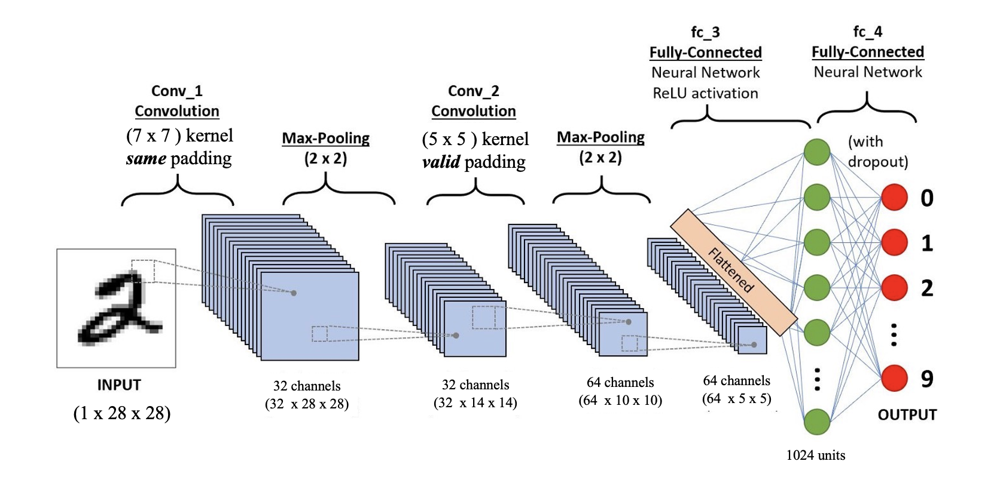

# Lab 4：卷积神经网络

## 习题1
对于一个输入为 $100 \times 100 \times 256$ 的特征映射组，使用 $3 \times 3$ 的卷积核，输出为 $100 \times 100 \times 256$ 的特征映射组的卷积层，求其时间和空间复杂度。如果引入一个 $1 \times 1$ 卷积核，先得到 $100 \times 100 \times 64$ 的特征映射组，再进行 $3 \times 3$ 的卷积得到 $100 \times 100 \times 256$ 的特征映射组，求其时间和空间复杂度。

## 习题2

### 问题描述

利用卷积神经网络实现对 `MNIST` 数据集的分类问题。

### 数据集

`MNIST` 数据集包括60000张训练图片和10000张测试图片。

图片样本的数量已经足够训练一个很复杂的模型（例如CNN的深层神经网络）。

它经常被用来作为一个新的模式识别模型的测试用例。

而且它也是一个方便学生和研究者们执行用例的数据集。

除此之外， `MNIST` 数据集是一个相对较小的数据集，可以在你的笔记本CPUs上面直接执行。

### 题目要求

按照图中给出的网络结构设计卷积网络，网络包含两个卷积层， `conv1` 和 `conv2` ，然后紧接着两个线性层作为输出，最后输出10个维度，这10个维度作为0-9的标识来确定识别出的是哪个数字。

完成代码填空，模型训练精度应该在96%以上。

### 可能遇到的问题

`anaconda` 可能存在安装 `pytorch` 后不包含 `torchvision` 模块的情况，如果出现这个问题记得安装，也可以到 https://pytorch.org/ 下载。

注意： `torchvision` 模块的版本需要和 `torch` 模块的版本对应，否则会报错，可以用 `pip install torchvision==XX` 来安装特定版本的 `torchvision` 。

