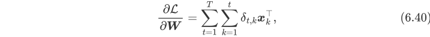
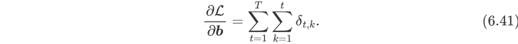
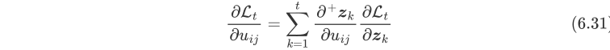

# Lab 5：循环神经网络

# 理论题

1. 推导公式(6.40)和公式(6.41)中的梯度。

2. 试验证公式(6.31)中的 $z_k(z_k = Uh_{k-1} + Wx_k + b)$ 对 $u_{ij}$ 直接求偏导数 $(\partial^{+}zk / \partial u_{ij})$ 等价于递归下去对 $h_{k-1}$ 接着求导。

# 代码题

## 问题描述
利用循环神经网络(LSTM)，实现简单的古诗生成任务

## 数据集
subset_poems.txt 内含一些五言诗句

## 题目要求
有两个py文件，其中是rnn.py是model，main.py是主函数程序
对main.py，rnn.py进行补全，并生成诗歌

- 要提交补全完后的main.py与rnn.py文件，同时把生成的诗歌注释在rnn.py开头
- 程序会跑一段时间，如果电脑跑不动等情况发生的话，可以只填代码并在rnn.py开头简单说明下电脑跑不动等原因
- 只看程序补全情况给成绩

> 另，生成的诗句可能很奇葩，属正常现象

## 模型大致结构

word embedding层 -> lstm层 -> 线性层

输入是一个序列 例如"清","明","时","节"的word index

输出的结果对应着词表中所有词的对应分数，分数越高代表着下一个词是它的越高概率

## 如果对人工智能生成诗句感兴趣
可以搜一下清华的"九歌"或华为的"乐府"试一下