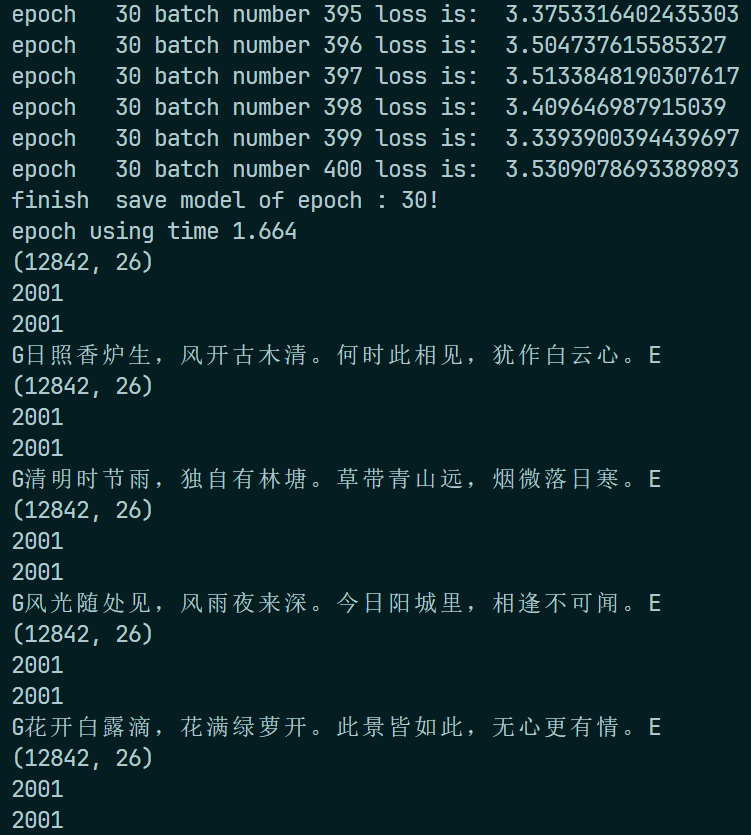
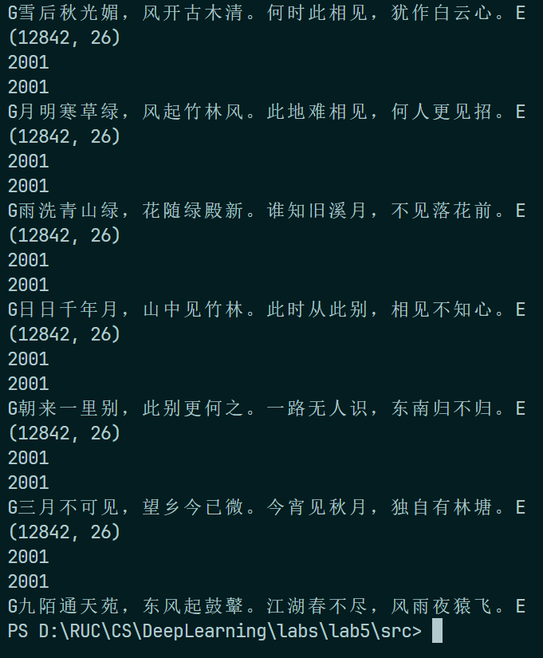

# Lab 5：循环神经网络

:man_student: Charles

## 理论题

**题目1：** 推导公式(6.40)和公式(6.41)中的梯度。

$$
\frac{\partial \mathcal{L}}{\partial \boldsymbol{W}} = \sum_{t=1}^T \sum_{k=1}^t \delta_{t, k} \boldsymbol{x}_k^\top, \tag{6.40}
$$

$$
\frac{\partial \mathcal{L}}{\partial \boldsymbol{b}} = \sum_{t=1}^T \sum_{k=1}^t \delta_{t, k}. \tag{6.41}
$$

**解答：** 

因为

$$
\boldsymbol{z}_k = \boldsymbol{Uh}_{k-1} + \boldsymbol{Wx}_k + \boldsymbol{b}
$$

所以
$$
\begin{align}
\frac{\partial \mathcal{L}}{\partial \boldsymbol{W}} &= \sum_{t=1}^{T} \frac{\partial\mathcal L_t}{\partial\boldsymbol{z}_k} \frac{\partial\boldsymbol{z}_k}{\partial\boldsymbol W} \\
&= \sum_{k=1}^{t} \frac{\partial\mathcal L_t}{\partial\boldsymbol{z}_k} \boldsymbol{x}_k^\top \\
\end{align}
$$

又因为定义了误差项 $\delta_{t,k}$ 为第 $t$ 时刻的损失对第 $k$ 步隐藏神经元的净输入 $\boldsymbol{z}_k$ 的导数，所以上式等于

$$
\sum_{t=1}^T \sum_{k=1}^t \delta_{t, k} \boldsymbol{x}_k^\top, \tag{6.40}
$$

即公式(6.40)

$$
\frac{\partial \mathcal{L}}{\partial \boldsymbol{W}} = \sum_{t=1}^T \sum_{k=1}^t \delta_{t, k} \boldsymbol{x}_k^\top
$$

同理可得公式(6.41)

$$
\frac{\partial \mathcal{L}}{\partial \boldsymbol{b}} = \sum_{t=1}^T \sum_{k=1}^t \delta_{t, k}
$$


**题目2：** 试验证公式(6.31)中的 $\boldsymbol z_k(\boldsymbol z_k = \boldsymbol U \boldsymbol h_{k-1} + \boldsymbol W \boldsymbol x_k + \boldsymbol b)$ 对 $u_{ij}$ 直接求偏导数 $\frac{\partial^{+} \boldsymbol z_k}{\partial u_{ij}}$ 等价于递归下去对 $h_{k-1}$ 接着求导。
$$
\begin{equation}
\frac{\partial \mathcal{L}_t}{\partial u_{ij}} = \sum_{k=1}^t \frac{\partial^+ \boldsymbol{z}_k}{\partial u_{ij}} \frac{\partial \mathcal{L}_t}{\partial \boldsymbol{z}_k} \tag{6.31}
\end{equation}
$$

**解答：**

由于隐状态 $\boldsymbol h_{k-1}$ 依赖于前一步的隐状态 $\boldsymbol h_{k-2}$ ，故可以通过链式法则递归求导。由于

$$
\boldsymbol{z}_k = \boldsymbol{Uh}_{k-1} + \boldsymbol{Wx}_k + \boldsymbol{b}, \\
\boldsymbol{h}_{k-1} = activation(\boldsymbol z_{k-1})
$$

当递归传播到第 $k-1$ 步的时候：

- 对 $\boldsymbol z_k$ 求导需要用到隐状态梯度： $\frac{\partial\boldsymbol z_k}{\partial\boldsymbol h_{k-1}} = \boldsymbol U$ ，表明当前时间步的梯度将被传递到 $\boldsymbol U$ 上
- 递归对 $\boldsymbol h_{k-2}$ 求导时，将通过上一步 $\boldsymbol z_{k-2}$ 的依赖项继续传播
- 最终，完整的梯度展开形式为

$$
\frac{\partial \mathcal{L}_t}{\partial u_{ij}} = \sum_{k=1}^t \frac{\partial\mathcal{L}_t}{\partial\boldsymbol{z}_k} \frac{\partial\boldsymbol{z}_k}{\partial\boldsymbol{h}_{k-1}} \dots \frac{\partial\boldsymbol{z}_1}{\partial{u}_{ij}}
$$

其中每一步递归传递都是由隐状态的依赖性实现的。故总的来说，递归求导过程中， $\boldsymbol h_{k-1}$ 的梯度被依赖结构传播到 $\boldsymbol z_k$ ，最终结果在数值上等价于直接求导的结果。 

## 代码题

### 问题描述
利用循环神经网络(LSTM)，实现简单的古诗生成任务

### 代码补全

根据注释提示，在 `rnn.py` 中补全 `RNN` 的定义如下：

```python
# RNN模型
# 模型可以根据当前输入的一系列词预测下一个出现的词是什么
class RNN_model(nn.Module):
    def __init__(self, vocab_len, word_embedding, embedding_dim, lstm_hidden_dim):
        super(RNN_model, self).__init__()
        self.word_embedding_lookup = word_embedding
        self.vocab_length = (
            vocab_len  # 可选择的单词数目 或者说 word embedding层的word数目
        )
        self.word_embedding_dim = embedding_dim
        self.lstm_dim = lstm_hidden_dim
        #########################################
        # 这里你需要定义 "self.rnn_lstm"
        # 其中输入特征大小是 "word_embedding_dim"
        #    输出特征大小是 "lstm_hidden_dim"
        # 这里的LSTM应该有两层，并且输入和输出的tensor都是(batch, seq, feature)大小
        # (提示：LSTM层或许torch.nn中有对应的网络层,pytorch官方文档也许有说明)
        # 填空：
        self.device = torch.device("cuda" if torch.cuda.is_available() else "cpu")
        self.rnn_lstm = nn.LSTM(
            input_size=self.word_embedding_dim,
            hidden_size=self.lstm_dim,
            num_layers=2,
            batch_first=True,
        )
        ##########################################
        self.fc = nn.Linear(self.lstm_dim, self.vocab_length)
        nn.init.xavier_uniform_(self.fc.weight)

    def forward(self, sentence, batch_size, is_test=False):
        batch_input = self.word_embedding_lookup(sentence).view(
            batch_size, -1, self.word_embedding_dim
        )
        ################################################
        # 这里你需要将上面的"batch_input"输入到你在rnn模型中定义的lstm层中
        # lstm的隐藏层输出应该被定义叫做变量"output", 
        # 初始的隐藏层(initial hidden state)和记忆层(initial cell state)应该是0向量.
        # 填空
        h0 = torch.zeros(2, batch_size, self.lstm_dim).to(self.device)
        c0 = torch.zeros(2, batch_size, self.lstm_dim).to(self.device)
        output, _ = self.rnn_lstm(batch_input, (h0, c0))
        ################################################
        out = output.contiguous().view(-1, self.lstm_dim)
        out = self.fc(out)  # out.size: (batch_size * sequence_length ,vocab_length)
        if is_test:
            # 测试阶段(或者说生成诗句阶段)使用
            prediction = out[-1, :].view(1, -1)
            output = prediction
        else:
            # 训练阶段使用
            output = out
        return output
```

在 `main.py` 中，补全预处理诗句的函数 `process_poems` 如下：

```python
def process_poems(file_name):
    # 读取文件
    poems = []
    with open(
        file_name,
        "r",
        encoding="utf-8",
    ) as f:
        for line in f.readlines():
            try:
                content = line.rstrip("\n")
                content = start_token + content + end_token
                poems.append(content)
            except ValueError as e:
                pass
    ####################################################
    # 填空------------------------------------------------------
    words = [word for poem in poems for word in poem]
    words_counter = collections.Counter(words)
    words = sorted(words_counter.items(), key=lambda x: -x[1])
    words, _ = zip(*words)

    # 建立字符和索引间的映射
    word_int_map = {word: idx for idx, word in enumerate(words)}
    int_word_map = {idx: word for idx, word in enumerate(words)}

    # 将诗句编码
    poems_vector = [[word_int_map[word] for word in poem] for poem in poems]
    ####################################################
    print(np.array(poems_vector).shape)  # 应该为 (12842, 26)
    print(len(word_int_map.keys()))  # 应该为 2001
    print(len(int_word_map.keys()))  # 应该为 2001
    return poems_vector, word_int_map, int_word_map
```

为加速训练，将模型和数据放在GPU上：

```python
my_device = torch.device("cuda" if torch.cuda.is_available() else "cpu")
(...).to(my_device)
```

运行 `main.py` ，训练并测试生成古诗：

|  |  |
| -------------------------------- | -------------------------------- |

