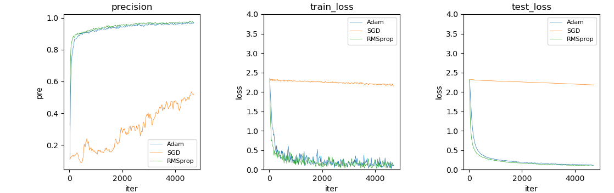
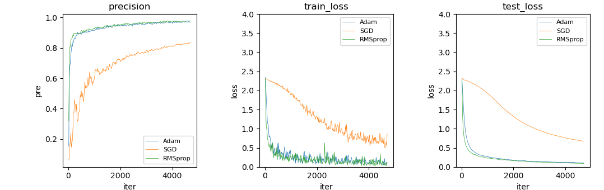
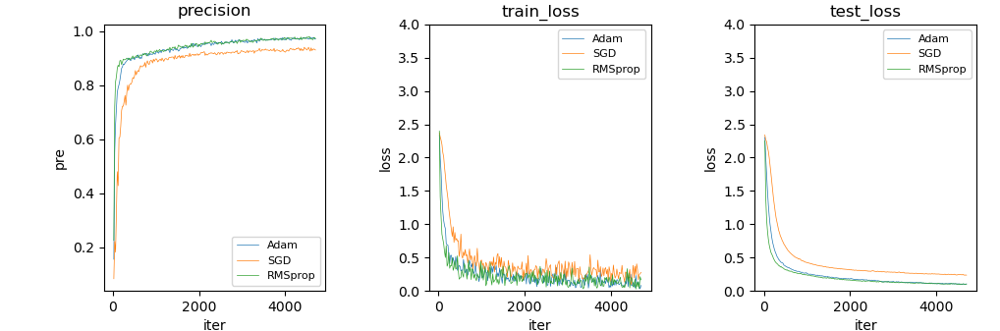
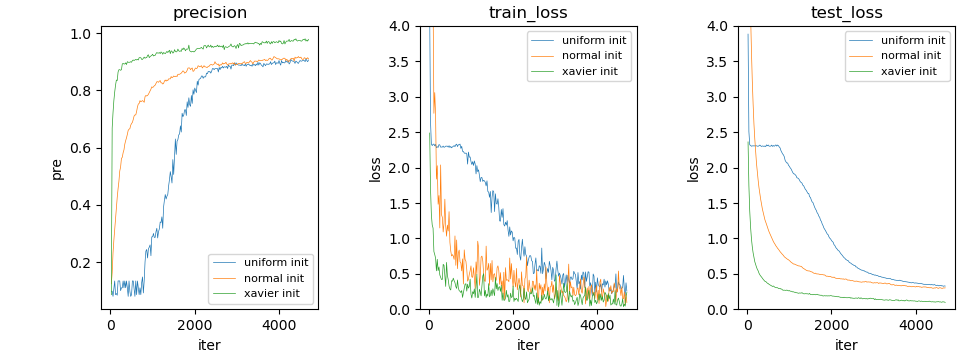

# Lab 7：网络优化与正则化

:man_student: Charles

## 理论题

**问题：** 试分析logistic regression的参数初始化为同样值，是否存在与神经网络同样的问题？

**解答：** 不会。因为logistic regression是线性模型，不存在神经网络中的隐藏层，即使参数初始化为相同的值，梯度下降过程中，参数也会被梯度更新、不会保持相等（梯度计算依赖数据 $\text{x}$ 和标签 $y$ ，而 $\text{x}$ 不相等）。

## 代码题

对于同一个神经网络，对比不同优化器和不同权重初始化的效果。

### 对比：不同优化器

给定 `Adam` 优化器，添加 `SGD` 和 `RMSprop` 优化器进行对比（优化器参数均相同）：

可以看到 `SGD` 效果很差，分析原因是三个优化器采用了相同的默认学习率 `LEARNING_RATE = 0.001` ，这对于 `SGD` 来说太小了。将 `SGD` 的学习率增大到0.01：

再尝试给 `SGD` 设置 `momentum = 0.9` 来平滑、加速收敛：

### 对比：不同权重初始化

对线性层权重进行正态分布初始化、均匀分布初始化、Xavier初始化后训练的结果如下：

可以看到，Xavier初始化的效果最好（收敛平滑、迅速）。